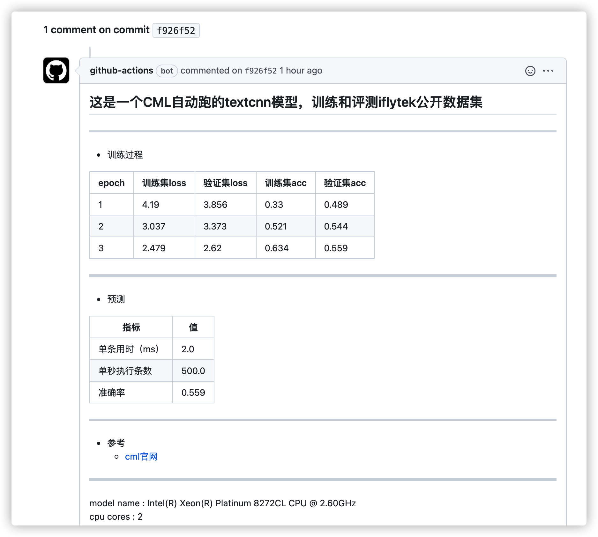

# cml4textcnn

[](https://actions-badge.atrox.dev/LowinLi/cml4textcnn/goto?ref=main)
[](https://github.com/LowinLi/cml4textcnn/blob/main/LICENSE)

## 标签
**MLOPS**,**CML**,**ONNX**,**textcnn**,**CLUE**,**Continuous**
## 简要
+ 使用`CML`工具的一个原创例子。
+ 在github的`actions`中，训练和批测`iflytek`数据集，批测准确率`55%`，onnx加速后，在github的action分配的资源中，单核cpu单条预测`2-4ms`。

## CML
#### CML是什么
[**CML**](https://cml.dev/)(Continuous Machine Learning)是[Iterative.ai](https://iterative.ai/)公司研发的一款开源工具，是在`CICD`中实现`MLOPS`(持续机器学习)的关键一步。当提交代码触发github的action或gitlab的pipeline时，可以自动把流水线上算法训练评测的关键指标通过markdown报告、图片甚至TensorBoard的形式存入commit信息中，如本项目所示。

**[链接地址](https://github.com/LowinLi/cml4textcnn/commit/f926f520c346ef5eb423edb53f09a6d77aab2ad6#commitcomment-58093966)**
#### 为什么要做`持续机器学习`

网上有很多介绍材料，这里不再赘述，仅谈一下对我个人的实际意义
1. 记录每个迭代commit版本，算法指标信息；
2. 流水线中统一的资源条件(私有化runner)；
3. 在多分支合作开发中，合入代码的指标信息供合入管理员参考。

## 本地运行
```shell
pip install --no-cache-dir torch==1.7.1+cpu -f https://download.pytorch.org/whl/torch_stable.html
pip install -r requirements.txt
cd dataset && sh download.sh
cd .. && python run.py
```
## textcnn模型
仅使用textcnn模型，加载开源词向量sgns.merge.word中训练集出现过的词的词向量矩阵，训练和评测著名榜单[CLUE](https://github.com/CLUEbenchmark/CLUE)中的[iflytek](https://github.com/CLUEbenchmark/CLUE#3iflytek-%E9%95%BF%E6%96%87%E6%9C%AC%E5%88%86%E7%B1%BB-long-text-classification)数据集，验证集准确率最高至`55%`，借助ONNX加速，单核cpu单条推断平均用时仅**2-4ms**（github服务器实际可用资源可能受到高峰期影响），相比较12层以上的transformers模型，例如CLUE上github首页的`RoBERTa-wwm-ext（60.31%）`，具有一定生产落地价值。


## 参考致谢
1. [CLUE](https://github.com/CLUEbenchmark/CLUE)
2. [cml](https://towardsdatascience.com/what-data-scientists-need-to-know-about-devops-2f8bc6660284?gi=d43983ac072b)
3. [cml.dev](https://cml.dev/)
4. [onnx](https://github.com/microsoft/onnxruntime)
5. [textcnn](http://emnlp2014.org/papers/pdf/EMNLP2014181.pdf)
6. [word2vec](https://github.com/Embedding/Chinese-Word-Vectors)
---
